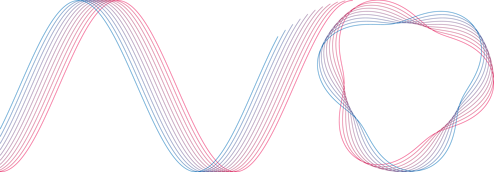

# Vanadium&reg; Avo&trade;



---

### Syntax Sample

```kotlin
complex Greeting {
    name: string
}

fun {
    fun greet(g: Greeting) {
        println("Hello, " + g.name + "!")
    }

    greet(new Greeting {
        name = "World"
    })

    fun sumNumbersBetween(a: int, b: int) -> int {
        var sum: int
        loop i excl a -> excl b {
            sum = sum + i
        }
        return sum
    }

    println("The sum between 0 and 10 is: " + sumNumbersBetween(0, 10))
}()
```

### API Example
```kotlin
fun main() {
    Interpreter {
        sourcePath { "input.avo" }
        functionLoaderSource(InternalConsoleFunctions::class)
        functionLoaderSource(InternalMathFunctions::class)
        errorHandling {
            exitOnError()
            handlerImplementation { MordantErrorHandler }
        }
    }.exists {
        run()
    }
}
```
